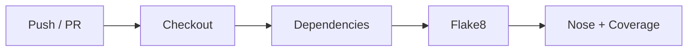
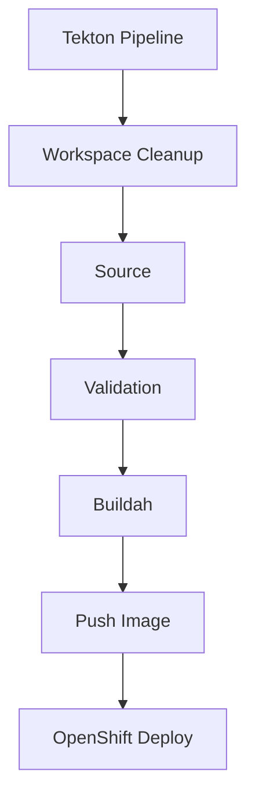
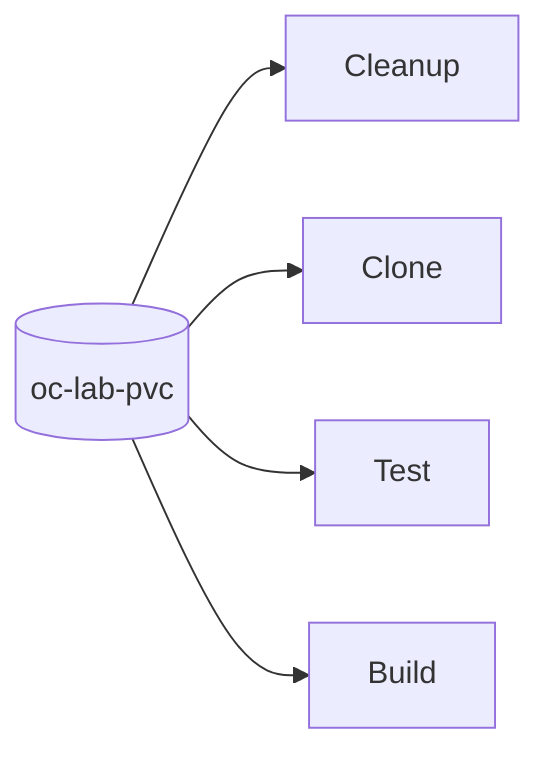
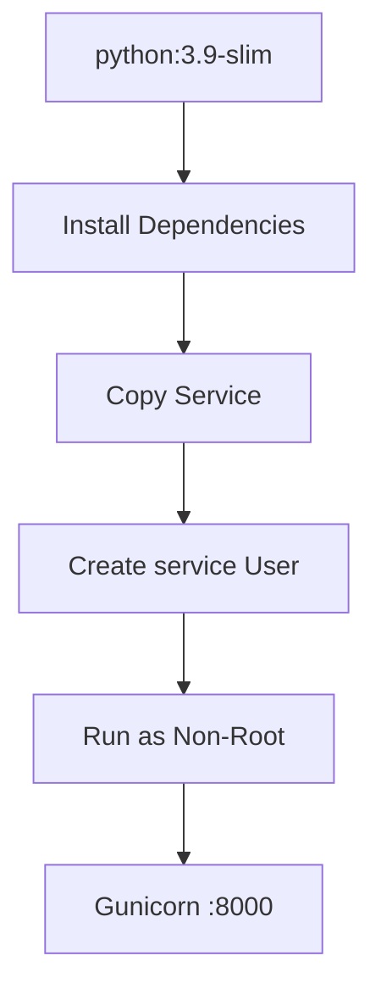
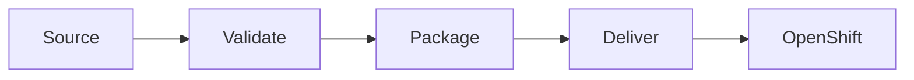

# GitHub Actions + OpenShift Pipelines (Tekton)

> [!NOTE]
> **Hybrid CI/CD:** GitHub Actions handles CI. OpenShift Pipelines (Tekton) handles Kubernetes-native delivery.

## Architecture

```mermaid
flowchart LR
    DEV[Developer] --> GH[GitHub]

    GH --> CI[GitHub Actions]
    CI --> LINT[Flake8]
    LINT --> TEST[Nose]

    TEST --> TEK[Tekton]
    TEK --> CLONE[Git Clone]
    CLONE --> VALIDATE[Lint + Test]
    VALIDATE --> BUILD[Buildah]
    BUILD --> REG[Container Registry]
    REG --> OCP[OpenShift]

    OCP --> APP[Application]
```



## CI



**Runtime:** `python:3.9-slim`

## CD



> [!NOTE]
> The committed `.tekton/tasks.yml` contains the reusable **cleanup** and **Nose** tasks. The complete Tekton flow is documented in the accompanying implementation walkthrough.

## Shared Workspace




**Workspace:** `output`
**Storage:** `1Gi PVC`

## Container



## Repository

```text
.github/workflows/
└── workflow.yml          # GitHub Actions CI

.tekton/
├── tasks.yml             # Tekton tasks
└── README.md

service/                  # Application
tests/                    # Tests
Dockerfile                # Runtime image
bin/setup.sh              # Local environment
```

## Delivery Model



### References

* **Implementation:** [GitHub Repository](https://github.com/barbaria888/tekton-workflow-openshift-deployment?utm_source=chatgpt.com)
* **Walkthrough:** <a href="https://hardik0811arora.hashnode.dev/when-github-actions-sync-with-openshift-pipelines-cicd">*When GitHub Actions Sync with OpenShift Pipelines: CI/CD* — Hashnode, 22 Nov 2025 </a>
